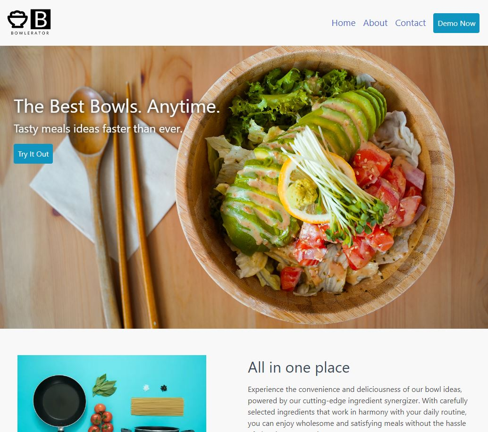

# This Page Belongs To

A bowl idea creator, demonstrating nextjs 13 and applying standard modern website design.

Live site here: [https://this-belongs-to.onrender.com/](https://this-belongs-to.onrender.com/)

## About

This project is an exploration of nextjs 13 which uses directory based routing with static and dynamic rendering methods. Another focus was to emulate modern website design for a typical small business, as detailed in this [medium article](https://kevin-lambda.medium.com/jr-dev-asks-whats-a-basic-website-layout-to-use-for-a-business-35ff4a7ef700).

## Key Technology

- Next.js 13
- Bulma css

## Acknowledgements

Image credits: [Chaewon Lee](https://unsplash.com/@elizabethlee?utm_source=unsplash&utm_medium=referral&utm_content=creditCopyText), [Icons8 Team](https://unsplash.com/ko/@icons8?utm_source=unsplash&utm_medium=referral&utm_content=creditCopyText), [I E](https://unsplash.com/@iemanuel?utm_source=unsplash&utm_medium=referral&utm_content=creditCopyText), [Monstruo Estudio](https://unsplash.com/@monstruoestudio?utm_source=unsplash&utm_medium=referral&utm_content=creditCopyText), [Anh Nguyen](https://unsplash.com/@pwign?utm_source=unsplash&utm_medium=referral&utm_content=creditCopyText), [Jason Goodman](https://unsplash.com/de/@jasongoodman_youxventures?utm_source=unsplash&utm_medium=referral&utm_content=creditCopyText), [Cytonn Photography](https://unsplash.com/@cytonn_photography?utm_source=unsplash&utm_medium=referral&utm_content=creditCopyText)

